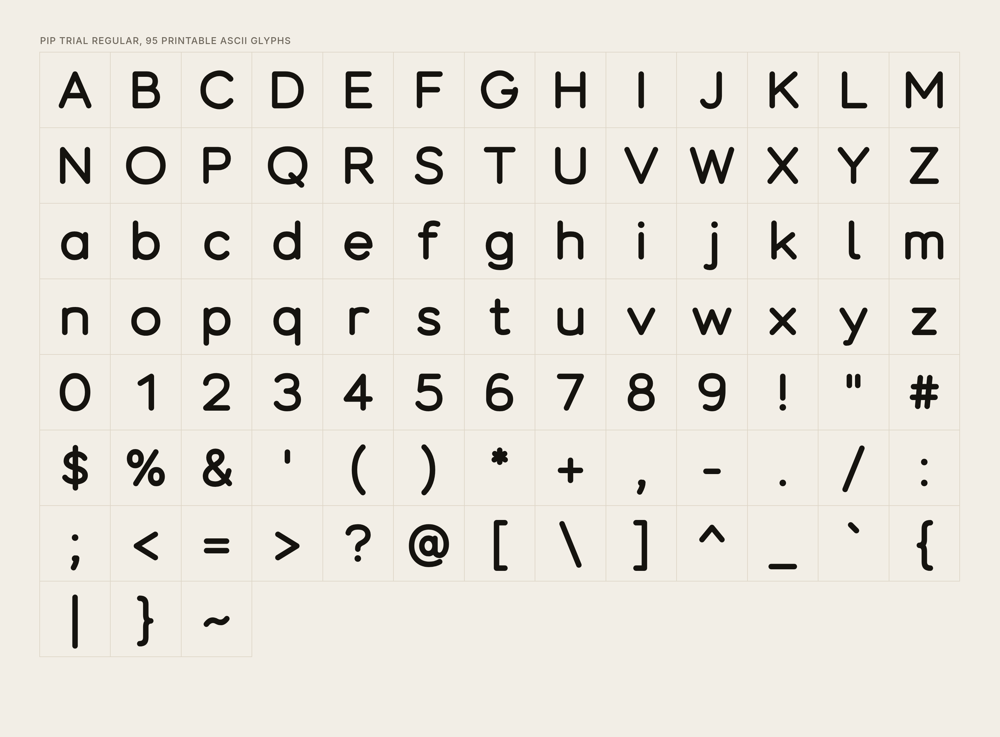
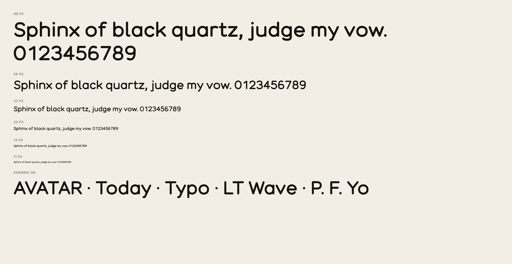
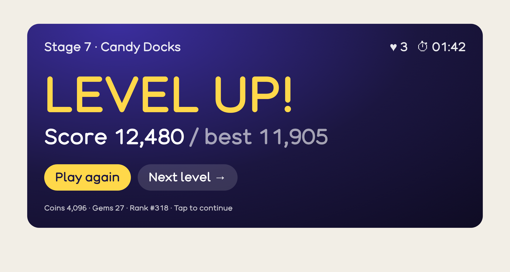
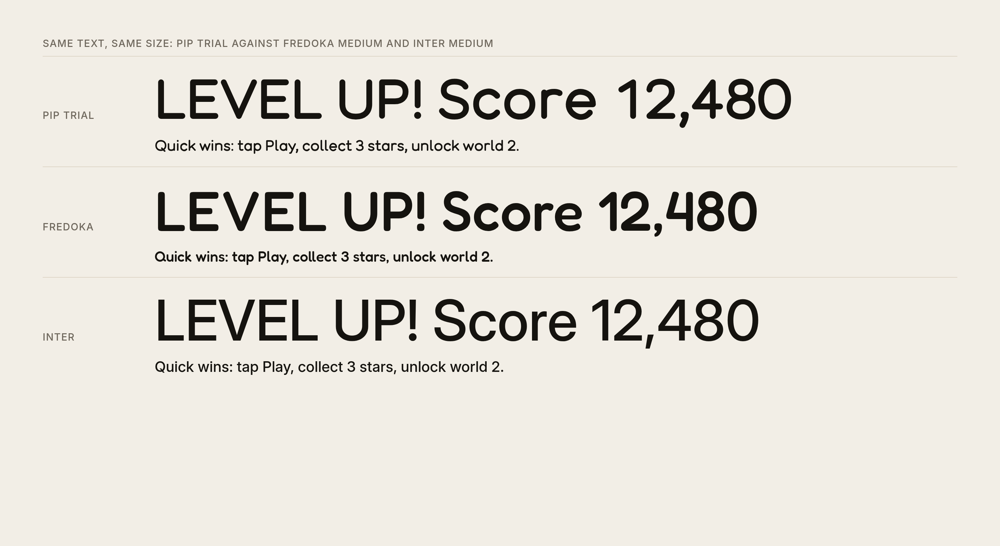
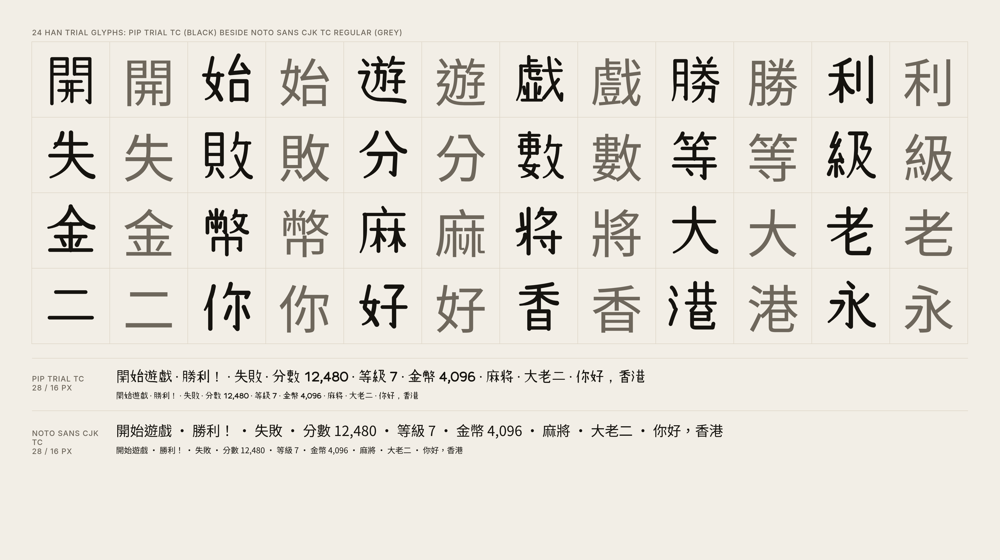

# Pip Trial (experiment)

A trial display typeface drawn from first principles in code, to judge by eye
how good a face made this way can be. It is not part of the brand and no
surface uses it.

- **Pip Trial Regular**: the 95 printable ASCII glyphs, kerning for the common
  pairs (AV, To, Ty, LT, P., and more), tabular figures (every digit is the
  same width, so scores and timers do not jitter), and a tailed `l` that tells
  `l`, `I` and `1` apart in UI text.
- **Pip Trial TC Regular**: 24 Traditional Chinese characters in the same
  voice (開始遊戲勝利失敗分數等級金幣麻將大老二你好香港永), to judge whether a
  CJK set is worth attempting.

Metrics: 1000 units per em, x-height 520, cap height 700, ascender 740,
descender -200, one stroke width (104 for Latin, 74 for Han), overshoot 12 on
round letters.

## How it is made

Every glyph is a set of centre lines (lines, cubic curves and elliptical arcs)
written in [source/latin.py](source/latin.py) and [source/han.py](source/han.py).
[source/skeleton.py](source/skeleton.py) expands each line at one width with
round caps and joins, merges overlaps into one clean outline in TrueType
direction, and converts it to quadratic curves. Equal stems follow by
construction; side bearings come from each glyph's ink box. Nothing is traced
from or copied out of another font.

```bash
python -m venv .venv && .venv/bin/pip install -r source/requirements.txt
.venv/bin/python source/build.py          # PipTrial-Regular and PipTrialTC-Regular, .ttf and .woff2
.venv/bin/python source/specimens.py /usr/bin/chromium Inter.ttf Fredoka.ttf   # specimens/*.png
```

The specimens are rendered by headless Chromium, so shaping and kerning are
the browser's. Inter and Fredoka are only loaded for the comparison image and
are not shipped here.

Han glyphs then go through [source/hanrules.py](source/hanrules.py): rules
that read only stroke geometry, never the character, so they apply to any
character added later. They set a common face size and centre of gravity,
thin the strokes of dense characters (optical weight), make horizontals
slightly thinner than verticals, taper left-falling strokes, swell
right-falling ones, shape dots and hooks, and even out the white space
between free parallel strokes. Side components (氵, 亻, 女 and others) take
their width from one table. [source/compare.py](source/compare.py) renders a
before/after sheet for each polish round ([specimens/polish/](specimens/polish/)).

## Specimens







## Licence

Copyright 2026 Sylphx Limited. SIL Open Font License 1.1 ([OFL.txt](OFL.txt)).
